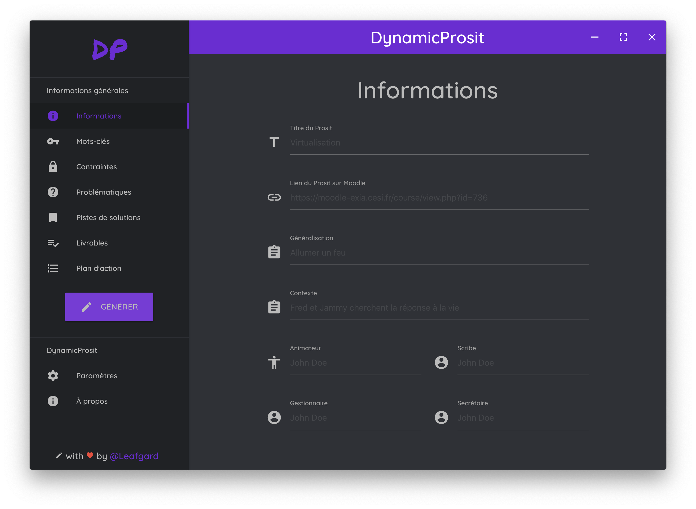

<h3 align="center">DynamicProsit</h3>

<i>Interface d'édition de Prosits</i>

  
  
  
  
  

  <a href="#fonctionnalites">Fonctionnalités</a> •
  <a href="#installation">Installation</a> •
  <a href="#utilisation">Utilisation</a> •
  <a href="#concu-avec">Conçu avec</a> •
  <a href="#license">License</a>

## Fonctionnalités

* Interface simpliste
* Permet de générer un document Word (.docx) contenant les données du Prosit
* Possibilité de réorganiser le plan d'action
* Possible autocomplétion des mots-clés via l'API de Wikipédia (Bêta)
* Thème clair / foncé
* Compatibilité MacOS / Windows et Linux !

## Installation

Téléchargez la dernière version [ici !](https://github.com/Leafgard/DynamicProsit/releases)

## Utilisation

Ouvrez l'application et amusez-vous !

## Conçu avec

* [electron](https://www.electronjs.org)^4.0.6 - Build cross platform desktop apps with JavaScript, HTML & CSS
* [docxtemplater](https://www.npmjs.com/package/docxtemplater)^3.9.9 - docxtemplater is a library to generate docx/pptx documents from a docx/pptx template.
* [jquery](https://www.npmjs.com/package/jquery)^3.3.1 - jQuery is a fast, small, and feature-rich JavaScript library
* [electron-settings](https://www.npmjs.com/package/electron-settings)^3.2.0 - A simple persistent user settings framework for Electron
* [material-design-icons](https://www.npmjs.com/package/material-design-icons)^3.0.1 - Material design icons are the official icon set from Google that are designed under the material design guidelines

## License

Ce projet est sous licence MIT - voir le fichier [LICENSE.md](LICENSE.md) pour plus de détails.
