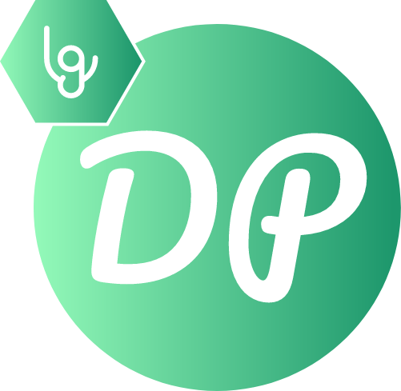

<h3 align="center">DynamicProsit</h3>

<i>Interface d'édition de Prosits</i>

  
  
  
  
  

  <a href="#fonctionnalites">Fonctionnalités</a> •
  <a href="#installation">Installation</a> •
  <a href="#utilisation">Utilisation</a> •
  <a href="#concu-avec">Conçu avec</a> •
  <a href="#license">License</a>

## Fonctionnalités

* Interface simpliste
* Permet de générer un .docx contenant les données du prosit aller
* Compatible MacOS (Pour l'instant !)

## Installation

Téléchargez la dernière version [ici !](https://github.com/Leafgard/DynamicProsit/releases)

## Utilisation

Ouvrez l'application et amusez-vous !

## Conçu avec

* [electron](https://www.electronjs.org)^3.0.10 - Build cross platform desktop apps with JavaScript, HTML & CSS
* [generate-docx](https://www.npmjs.com/package/generate-docx)^2.1.0 - Generates .docx from template and data
* [jquery](https://www.npmjs.com/package/jquery)^3.3.1 - jQuery is a fast, small, and feature-rich JavaScript library

## Membres

* **Yann SEGET** - *Auteur principal* - *dev@leafgard.fr*

[https://github.com/Leafgard/DynamicProsit](https://github.com/Leafgard/DynamicProsit)

## License

Ce projet est sous licence MIT - voir le fichier [LICENSE.md](LICENSE.md) pour plus de détails.
