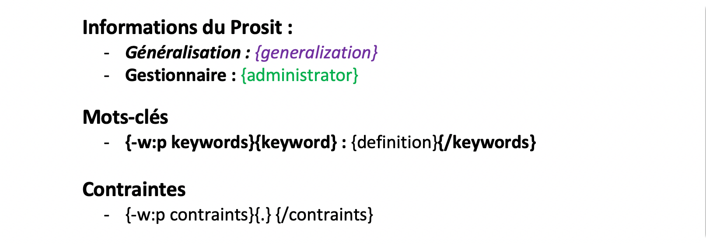
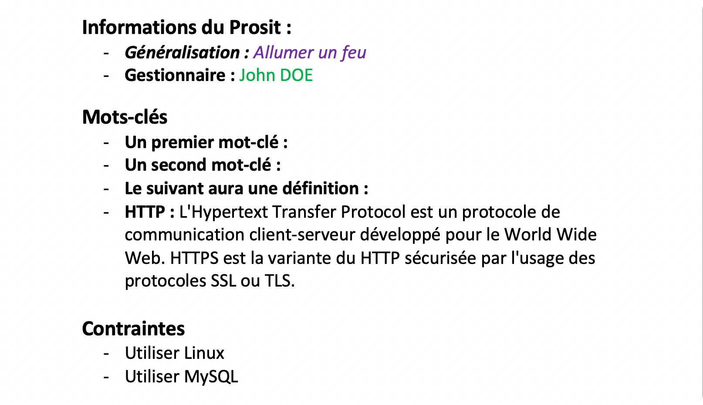

<h3 align="center">DynamicProsit</h3>

<i>Interface d'édition de Prosits</i>

  
  
  
  
  

  <a href="#fonctionnalites">Fonctionnalités</a> •
  <a href="#installation">Installation</a> •
  <a href="#utilisation">Utilisation</a> •
  <a href="#concu-avec">Conçu avec</a> •
  <a href="#license">License</a>

## Fonctionnalités

* Interface simpliste
* Permet de générer un document Word (.docx) contenant les données du Prosit
* Possibilité de créer son propre modèle et l'importer
* Possibilité de réorganiser le plan d'action
* Possible autocomplétion des mots-clés via l'API de Wikipédia (Bêta)
* Sauvegarde automatique au fur et à mesure de la complétion du Prosit pour éviter une perte des données en cas de crash
* Thème clair / foncé
* Compatibilité MacOS / Windows et Linux !

## Installation

Téléchargez la dernière version [ici !](https://github.com/Leafgard/DynamicProsit/releases)

## Utilisation

### Créer son propre modèle

Dès la version **3.0.0**, vous avez la possibilité de créer et d'ajouter votre propre modèle !

Il vous suffit de créer un nouveau document Word, et d'y inscrire les tags suivant pour remplacer les données remplies dans DynamicProsit.

#### Liste des tags

- `{title}` - Titre
- `{link}` - Lien du Prosit sur Moodle
- `{date}` - Date & heure à la génération du Prosit
- `{generalization}` - Généralisation
- `{context}` - Contexte
- `{animator}` - Animateur
- `{scribe}` - Scribe
- `{secretary}` - Secrétaire
- `{administrator}` - Gestionnaire
- `{-w:p keywords}{keyword} : {definition}{/keywords}` - Liste des mots-clés : définition (Si existant !)
- `{-w:p contraints}{.} {/contraints}` - Liste des contraintes
- `{-w:p problematics}{.} {/problematics}` - Liste des problématiques
- `{-w:p solutions}{.} {/solutions}` - Liste des pistes de solutions
- `{-w:p deliverables}{.} {/deliverables}` - Liste des livrables
- `{-w:p actions}{.} {/actions}` - Liste du plan d'action

Les tags sont sensibles aux styles que vous leur donnez, par exemple, si vous écrivez `{animator}` en *italique*, il remplacera le tag par le nom de l'animateur en *italique* !

Voici un exemple:

  
   
  
   
  

## Conçu avec

* [electron](https://www.electronjs.org)^4.0.6 - Build cross platform desktop apps with JavaScript, HTML & CSS
* [docxtemplater](https://www.npmjs.com/package/docxtemplater)^3.9.9 - docxtemplater is a library to generate docx/pptx documents from a docx/pptx template.
* [jquery](https://www.npmjs.com/package/jquery)^3.3.1 - jQuery is a fast, small, and feature-rich JavaScript library
* [electron-store](https://www.npmjs.com/package/electron-store)^2.0.0 - Simple data persistence for your Electron app or module - Save and load user preferences, app state, cache, etc
* [material-design-icons](https://www.npmjs.com/package/material-design-icons)^3.0.1 - Material design icons are the official icon set from Google that are designed under the material design guidelines
* [moment](https://momentjs.com/)^2.24.0 - Parse, validate, manipulate, and display dates and times in JavaScript.

## License

Ce projet est sous licence MIT - voir le fichier [LICENSE.md](LICENSE.md) pour plus de détails.
